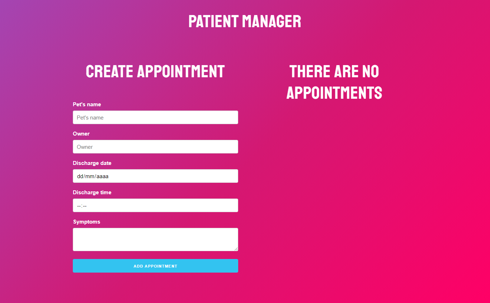
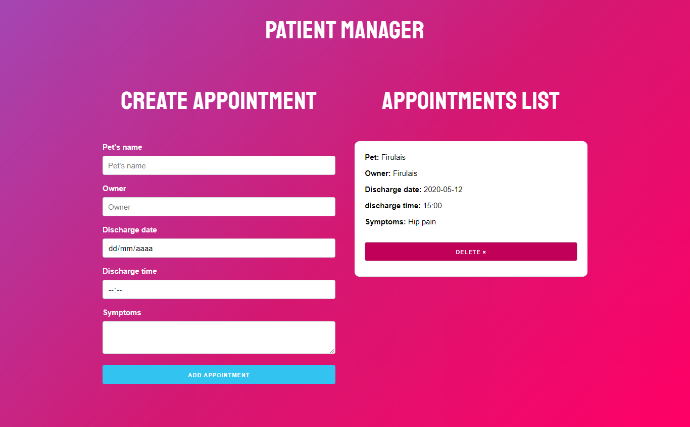

<h1>Appointment Application</h1>
<h2>Description</h2>
<p>Small application appointments for patients</p>
<h2>Languages</h2>
<ul>
  <li>HTML</li>
  <li>CSS</li>
  <li>JS</li>
</ul>
<h2>Tools</h2>
<ul>
  <li>React</li>
  <li>Hooks</li>
  <li>Skeleton</li>
  <li>uuid</li>
</ul>
<h2>Installation</h2>

```
npm install
```

<h2>Run the project</h2>

```
npm run start
```
<h2>Previews</h2>

Try the live demo https://infallible-boyd-00dc6a.netlify.app




